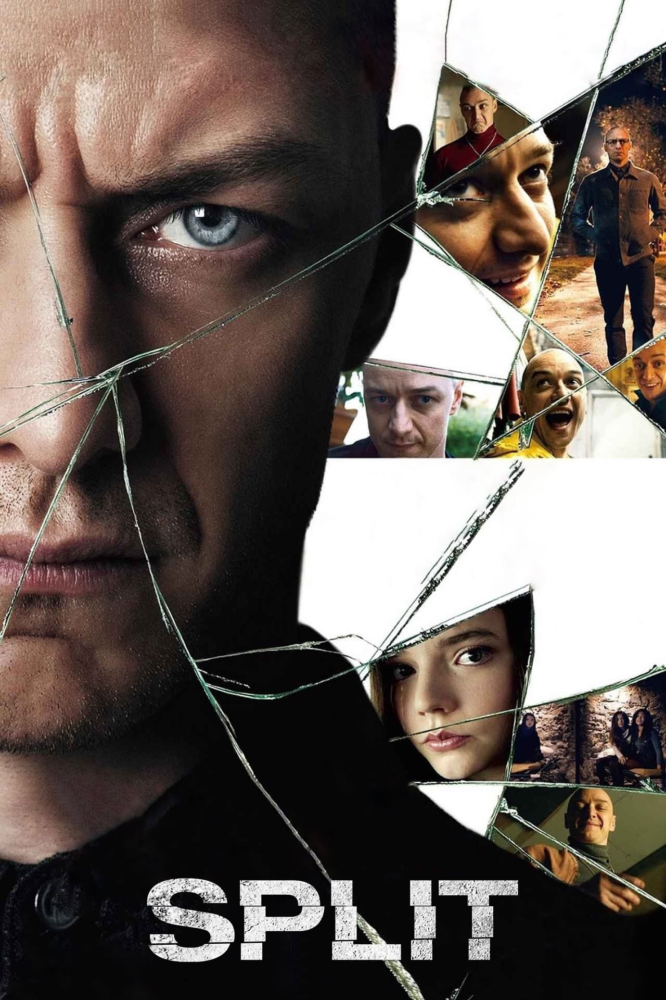

# blurify
Small Python script to convert an image into a slowly unblurring video.

### Requirements
+ `PIL`
+ `imageio`
+ `numpy`

### How to use ?
+ `git clone https://github.com/AlbertCalmus/blurify.git`
+ `cd/blurify`
+ `python blurify.py <img_path>`

### Example
| Input                    | Output                   |
|--------------------------|--------------------------|
| | |
